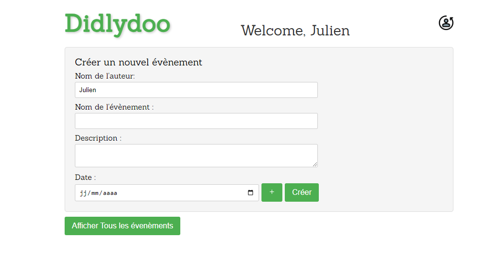
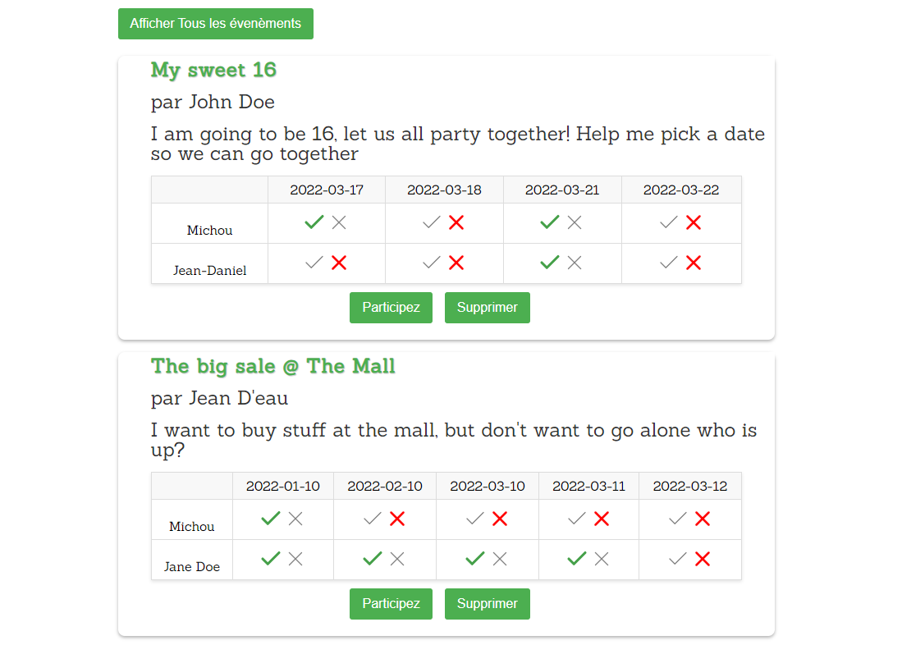

# Didlydoo

Didlydoo is your go-to web application for hassle-free event planning. Whether it's a casual get-together or a family reunion, Didlydoo simplifies the process of coordinating schedules and finding the perfect date for everyone involved. Dive into the world of seamless event management with Didlydoo!

## Features

- **Event Overview**: Easily browse through a comprehensive list of events, complete with participant availability.
- **Event Creation**: Empower users to create new events effortlessly by providing essential details.
- **Availability Tracking**: Seamlessly manage participant availability for proposed event dates.
- **Event Editing**: Modify event details such as name, description, and organizer.
- **Event Deletion**: Remove events that are no longer needed.

## Bonus Feature

- **Smart Scheduling**: Didlydoo automatically calculates the best date for an event based on participant availabilities.

## Tech Stack
- **HTML, CSS/SASS, JavaScript**: Responsible for structure, presentation, and interactive behavior.
- **Node.js**:(with Express.js): Sets up the web server to handle HTTP requests.
- **BEM Methodology & SCSS**: Ensuring clean and maintainable styling.
- **Modules**: Keeping the codebase organized and modular.
- **GroupWork**: Git/GitHub.

( Work in Progress.)